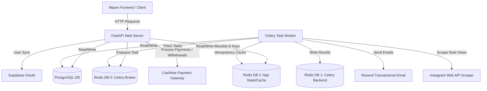

# Mipoe Backend LLM Wiki: High-Level Architecture Map

Welcome to the persistent memory layer and documentation core of the Mipoe Backend. This wiki serves as the ground truth for architectural patterns, configurations, API contracts, and background task flows.

---

## 🗺️ Project Architecture Overview

Below is the conceptual layout of the Mipoe system. The backend functions as the main orchestration engine, interfacing with client apps, databases, task queues, caching layers, and external SaaS providers.



---

## 🗂️ Workspace & Module Layout

The codebase is organized as follows:

```text
Mipoe-Backend/
├── app.py                      # Main entrypoint script (boots uvicorn server)
├── config.py                   # Root configuration wrapper for legacy scripts
├── models.py                   # Root legacy models loader
├── scheduler.py                # CLI scheduler runner (runs maintenance tasks synchronously)
├── tasks.py                    # Root utility script (verifies Supabase JWT signatures)
├── utils.py                    # Root utilities
├── requirements.txt            # Python dependencies list
├── .wiki/                      # [NEW] Root LLM Wiki Memory Layer (this directory)
└── backend/                    # Core modular Python application package
    ├── main.py                 # FastAPI application initializer & middleware config
    ├── api/                    # API orchestration layer
    │   ├── deps.py             # Dependency injection (Auth, CurrentUser, Database sessions)
    │   ├── router.py           # Combined API router registry
    │   └── routers/            # Feature-specific API endpoint handlers
    │       ├── admin.py        # Moderation, clip auditing, platform wallet management
    │       ├── auth.py         # Login, registration, cookie session, Google OAuth sync
    │       ├── brands.py       # Brand campaign creation, budget allocation, profile updates
    │       ├── campaigns.py    # Public campaign exploration, analytics and rankings
    │       ├── creators.py     # Profile settings, clip submissions, Instagram linking
    │       ├── payments.py     # Deposit orders, wallet balances, payouts, refunds
    │       └── system.py       # Health checks
    ├── core/                   # Core system configuration and security settings
    │   ├── config.py           # Pydantic-based settings loading (.env parsing)
    │   └── security.py         # Argon2 password hashing and PyJWT token utilities
    ├── db/                     # Database access layer
    │   ├── base.py             # SQLAlchemy Declarative Base (Base)
    │   ├── models.py           # Complete project SQLAlchemy schema models
    │   └── session.py          # SQLAlchemy Async Engine and session builder, Redis client
    ├── schemas/                # Pydantic data schemas (Request/Response validators)
    │   ├── auth.py             # Credentials and verification schemas
    │   └── common.py           # Profile, campaign, payment, and submission schemas
    ├── services/               # Reusable business logic and external service clients
    │   ├── campaigns.py        # Campaign fetching, clip serialization, and rankings logic
    │   ├── cashfree_verify.py  # Cashfree sync PAN validation API service
    │   ├── email.py            # Transactional email composition services (Resend)
    │   ├── notifications.py    # Notification appending using JSONB arrays
    │   └── supabase_auth.py    # Supabase token validation and profile retrieval
    └── tasks/                  # Celery application and background worker tasks
        ├── celery_app.py       # Celery application setup, serializer & broker definitions
        ├── emails.py           # Transactional email queue workers
        ├── maintenance.py      # Scheduled campaign deactivation and clip deletion
        ├── metrics.py          # Scraper-based Reel metrics update task
        ├── onboarding.py       # Async PAN verification background task runner
        └── payouts.py          # Automatic hourly milestone payouts distribution
```

---

## 📖 Wiki Navigation

Please refer to the following wiki files to understand specific layers of the backend:

1. **[SYSTEM.md](SYSTEM.md)**: The Backend Contract. Explains structural layouts, async patterns, session management, error handling conventions, coding style guide, and the wiki self-maintenance policy.
2. **[INFRASTRUCTURE.md](INFRASTRUCTURE.md)**: Details the infrastructure stack, Celery + Redis multi-DB partitioning, Docker configuration instructions, future Cloudflare Edge routing, service dependencies, and environment variable requirements.
3. **[CELERY_FLOW.md](CELERY_FLOW.md)**: Deep dive into the Celery task-queue architecture, describing task behaviors, routing, backoffs, database state management inside workers, and idempotency guarantees.
4. **[API_CONTRACTS.md](API_CONTRACTS.md)**: Summarizes all router groups, endpoint contracts, required headers, Pydantic input models, and integration points with Supabase OAuth and Cashfree gateway.

---

> [!NOTE]
> This wiki is the source of truth for the codebase. If the actual code behaves differently from the wiki, it represents either a bug in the code or an undocumented change. Developers must update these docs immediately when updating the code.
